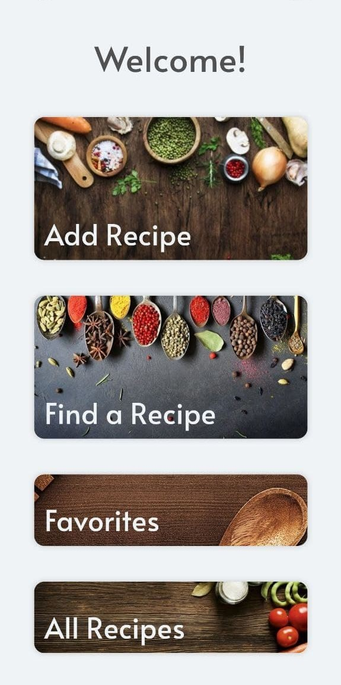
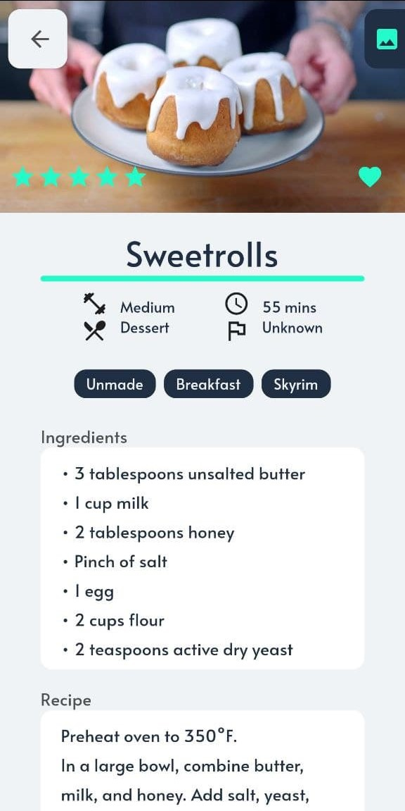
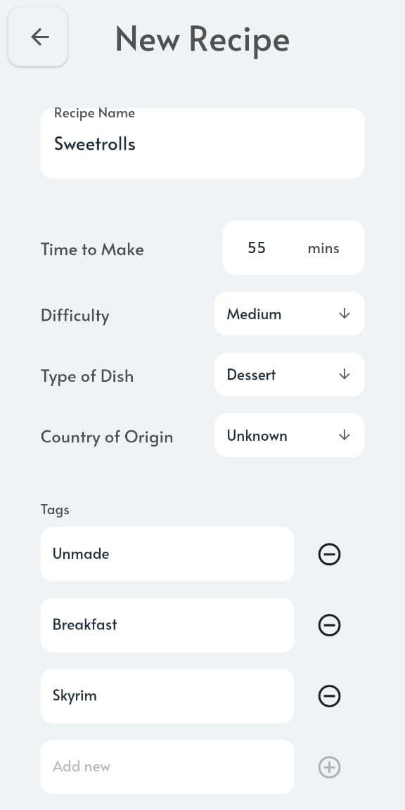

# Nectar - Cookbook app

## Nectar is a handy app to keep track of all your recipes. Never again be at a loss when looking for something to cook.

## Features
- Search recipes by ingredients 
- Search by keywords in titles, ingredients, or recipe descriptions
- Use tags any you want to categorize your recipes best suited to you organizational style
  - Some tagging ideas
    - Use a friend's name to tag recipes they like
    - Use the *Unmade* tag to keep track of recipes you have yet to try
    - Tag festive recipes by holiday
- Use the default parameters for recipes' common properties, such as Time to make, Difficulty, Type of dish, and Country of origin

### Screenshots from the app:

